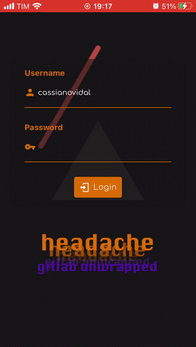
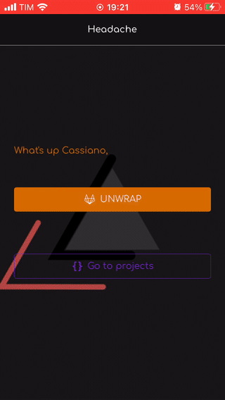

<h1 align="center">
  headache 🤕
</h1>

A ~~poorly~~ GitLab data unwrapper (like the spotify unwrapped but sadder u_u) and projects visualizer   
> Note: GitLab server hosted by the UFPR

<div style="color:#333333">

### 😶 What's the goal of this project?

This application was developed as an assignment for the mobile development course from the Systems Analysis and Development graduation course of the Federal University of Parana. The objective is practice react native and more specific authentication with some external service. In this case it's the GitLab server maintened in the SEPT in the UFPR.

The requirements of this project involves:
- Authenticate in the given API (GitLab API)   
- Persist the login with something like the Async Storage
- Nested navigation at least with [Stack](https://reactnavigation.org/docs/stack-navigator) and [Drawer](https://reactnavigation.org/docs/drawer-navigator) navigation   
- Use components from the [React Native Elements](https://reactnativeelements.com/) library (or similar like [Paper](https://callstack.github.io/react-native-paper/))   
- Request data from the given API to fetch user info   

### 🖥 How do these stuff work?

The application was made using ```expo init```. The only libraries were [React](https://pt-br.reactjs.org/), [React-Native](https://reactnative.dev/), [React-Navigation](https://reactnavigation.org/), [React Native Elements](https://reactnativeelements.com/) and everything that comes with [Expo](https://expo.io/).   

The application provides two options for the user:   
1. Enter the 'Unwrap GitLab' which will analyse some very basic data about GitLab projects, groups and commits. The analysis are very simple, limited to show stuff like commit numbers, projects number and giving an unsolicited opinion :)   
2. Enter in the projects section which will present the logged user projects in a list. The projects are touchable, leading the user to the respective project page.   

The user's infos are displayed in the drawer menu and includes the username, full name, email and avatar.

### 🔭 Overview of the application

Fig 1 - Splash screen


Fig 2 - Login and link to GitLab profile



Fig 3 - Going through the unwrap feature


Fig 4 - Scrolling projects and accessing the project page on GitLab



Fig 5 - Starting the application using a stored user (in Async Storage)


Fig 6 - Logout


### 🚜 What is under the hood?

Is just a React Native App build with Expo framework that uses React Navigation and React Native Elements
#### General
- [NPM](https://www.npmjs.com/)
- [React](https://pt-br.reactjs.org/)
- [React-Native](https://reactnative.dev/)
- [React-Navigation](https://reactnavigation.org/)
- [React Native Elements](https://reactnativeelements.com/)
- [Expo](https://expo.io/)

> Note: Make sure you have Node v12.* or above, NPM in command line and the Expo CLI

> Credits: The gifs used as background images are al public from [Giphy](https://giphy.com/)
### 🎛 So... How to set up the environment?

As mentioned before, it's required to have Node with version 12 or above, NPM in command line and Expo CLI.

There are basically two steps to make everything work:
1.Install the dependencies
2.Start the App

The steps can be done as follows:

```bash
# In the root directory of the application:
$ npm install       # This will download and install all of the dependencies
$ expo start        # This will start the application 
```

After that the application will be available through the Metro Bundler and the user can run it in the Android or iOS emulator or on physical devices.

</div>